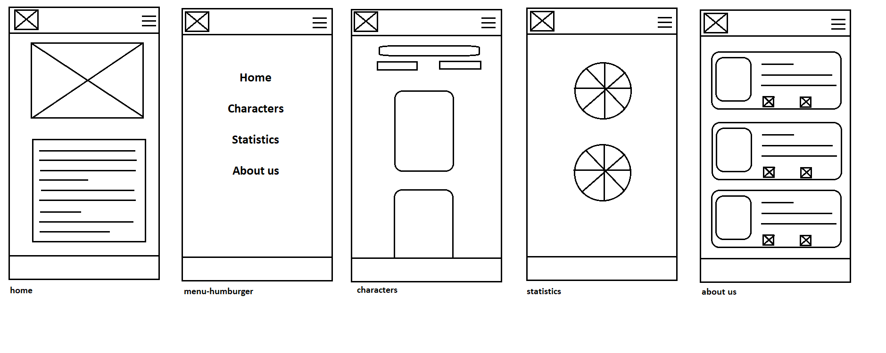
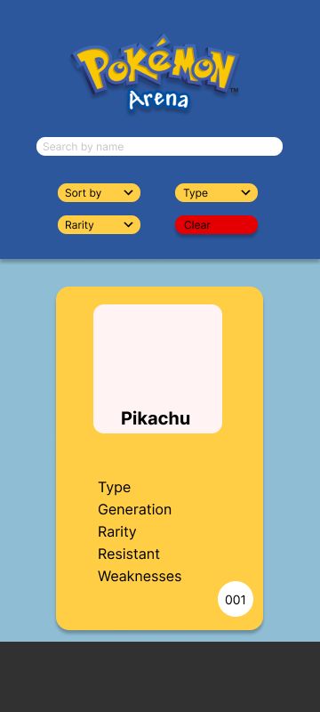
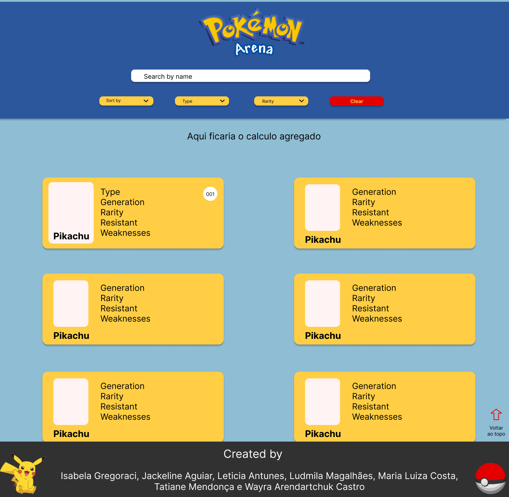

# Pokémon Arena

## Índice

- [1. Sobre o projeto](#1-sobre-o-projeto)
- [2. Desenvolvedoras](#2-desenvolvedoras)
- [3. Interface do usuário](#3-interface-do-usuario)
- [4. Tecnologias utilizadas](#4-tecnologias-utilizadas)
- [5. Como usar](#5-como-usar)

---

## 1. Sobre o projeto

Pokémon Arena, é um plataforma criada para facilitar a vida do usuário; tendo em vista que são 251 Pokémons. Pokémon Arena, reúne diversas informações relevantes para os usuários do universo Pokémon. Desenvolvemos esta aplicação para unir fãs que buscam dados sobre todas as gerações de Pokémons, como por exemplo: espécies, raridades, forças e fraquezas. Além desses dados, o usuário encontrará, exibido em porcentagens, as informações sobre as quantidades de elementos retornados da pesquisa. O desafio desse projeto foi planejar e desenvolver a refatoração de uma página já existente. Abaixo, você pode conferir a versão anterior:  

## 2. Desenvolvedoras
[Isabela Gregoraci](https://github.com/Gregisa), [Jackeline Aguiar](https://github.com/JackeAguiar), [Leticia Antunes](https://github.com/leticiaantunesjpeg), [Ludmila Magalhães](https://github.com/Lud-ic), [Maria Luiza Costa](https://github.com/MariaLuizaSantana), [Tatiane Mendonça](https://github.com/Tati-Mendonca) e [Wayra Arendartchuk](https://github.com/WayraArendartchukCastro).

## 3. Interface do usuário

Desenvolvemos os protótipos de baixa e alta fidelidade através da plataforma Figma.
 
 

### - Protótipo de baixa fidelidade

 
 

### - Protótipo de alta fidelidade
 

#### Mobile

 
 

#### Desktop

## 4. Tecnologias utilizadas

- Trello
- Figma
- HTML5
- CSS3
- JavaScript Vanilla
- Node.js
- Git e GitHub

## 5. Como usar

Você precisará usar o Node.js

Clonar o projeto

` $ git clone https://github.com/Lud-ic/pokemon-arena.git`

Instalar as dependências do projeto

` $ npm install or yarn`

Iniciar a aplicação

` $ npm start or yarn start`

Realizar os testes unitários

` $ npm test or yarn test`
